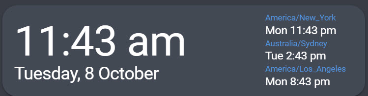

# Clockwork Card

**Current Version:** 0.1.3

This is a simple little custom lovelace element that shows a clock and some extra timezones for Home Assistant.

It may break, it may work. For now, it works.

Anyone who wants to fork it and make it better, by all means PLEASE go for it. Will also accept pull requests.

I pretty much stole the idea from [Mikael T](https://community.home-assistant.io/t/palm-springs-theme/103533) and then hacked it up to do what I wanted.

If by some miracle it works it should look like this:

## DISCLAIMER

*This was never intended for external use, but was asked a couple times to release it so I did.
Use at own risk, absolutely minimal testing has been completed. Milage may very.*

## INSTALLATION

To install add it to your custom lovelace folder and then reference it accordingly

```yaml
resources:
  - url: /local/custom-lovelace/clockwork-card.js
    type: js
```

## CONFIGURATION

Then in your lovelace configuration edit accordingly.
It requires you have an existing [date_time_iso](https://www.home-assistant.io/integrations/time_date/) sensor. (Actually it doesnt read note below)

The Rest should be pretty self explanatory.

```Yaml
  - type: 'custom:clockwork-card'
    #title: "My Time"
    locale: en-AU
    entity: sensor.date_time_iso
    other_time:
      - "America/New_York"
      - "Australia/Sydney"
      - "America/Los_Angeles"
```


### iPhone/Safari
 So safari (i.e. mac and ios) has a quirky *feature* where it imports date/time as UTC time even when not specifically expressed. So on your iPhone or on a Mac, everything will be out by exactly your timezone.

So in this case, dont use an entity. However the time shown will be LOCAL for your device. In other words, if your phone is in a different timezone, it will show that time, and not the time wherever your HomeAssistant instance is.

Will try to fix this.

## TODO LIST
    [ ] Fix iPhone issue.
    [ ] Integrate with HACS.
    [ ] Clean up README and more detailed install 
    [ ] Have ability to choose whether to show local device time or HomeAssistant time.


[](https://www.buymeacoffee.com/pJ9AUGuoE)
